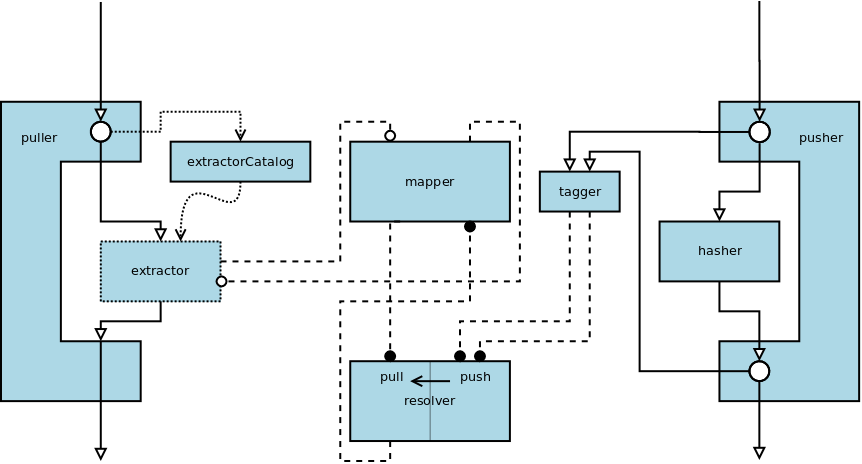

# cache-crusher [](https://travis-ci.org/tapirdata/cache-crusher) [](https://david-dm.org/tapirdata/cache-crusher) [](https://david-dm.org/tapirdata/cache-crusher#info=devDependencies)

> A cache-buster for [gulp](http://gulpjs.com), that integrates itself neatly into your tasks.

## Usage

Let's say, you have this simplified directory structure:

```bash
gulpfile.js
src
├── client
│   ├── pages
│   │   └── main.html
│   └── styles
│       └── main.css
└── server
    └── scripts
        └── start.js
```
You may find the whole example project under `examples/simple`.

The following `gulpfile.js` effectively just copies the `src`-tree into `dist` and runs an express-server that statically serves the contents of `dist/client` under the url `/static`.

```javascript
gulp = require('gulp');
cacheCrusher = require('cache-crusher');

crusher = cacheCrusher({
  mapper: {
    counterparts: [{urlRoot: '/static', tagRoot: 'src/client'}]
  }
});

gulp.task('build-client-styles', function() {
  return gulp.src('src/client/styles/*.css')
  .pipe(crusher.pusher())
  .pipe(gulp.dest('dist/client/styles'));
});

gulp.task('build-client-pages', function() {
  return gulp.src('src/client/pages/*.html')
  .pipe(crusher.puller())
  .pipe(gulp.dest('dist/client/pages'));
});

gulp.task('build-server-scripts', function() {
  return gulp.src('src/server/scripts/*.js')
  .pipe(gulp.dest('dist/server/scripts'));
});

gulp.task('build', [
  'build-client-styles',
  'build-client-pages',
  'build-server-scripts']);

gulp.task('run', ['build'], function() {
  require('./dist/server/scripts/start.js');
});

gulp.task('default', ['run']);
```

…indeed, there is a little bit more to see here: As we pipe our resource (`main.css`) through a __pusher__, it will be automatically renamed to `main-<digest>.css`; as we pipe our referrer (`main.html`) through a __puller__, it will be scanned for references that start with the (configurable) `urlBase` `/static` and get that references be replaced by the appropriately renamed ones.

The only thing we must configure (but there is much more we *may*) is some mapping between urls and so called __tags__ (These are path-like strings; by the default, they are generated as the vinyl-file's `path` relative to `crusher.cwd`, which in turn defaults to `process.cwd()`) by specifying the option `mapper.counterparts`.

## Architecture

…will be documented soon.



## Options

…will be documented soon.

